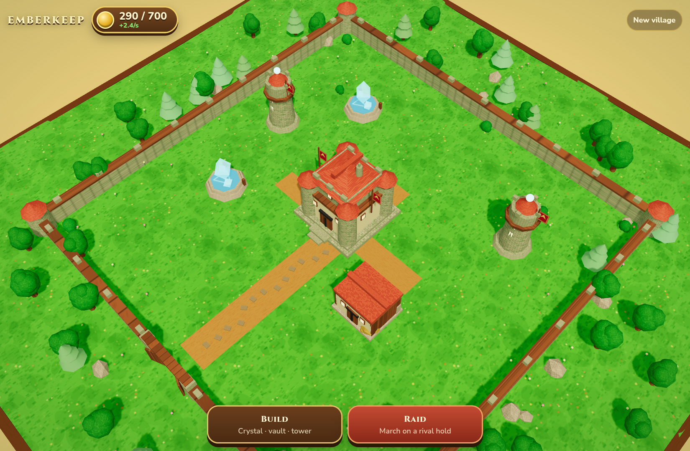
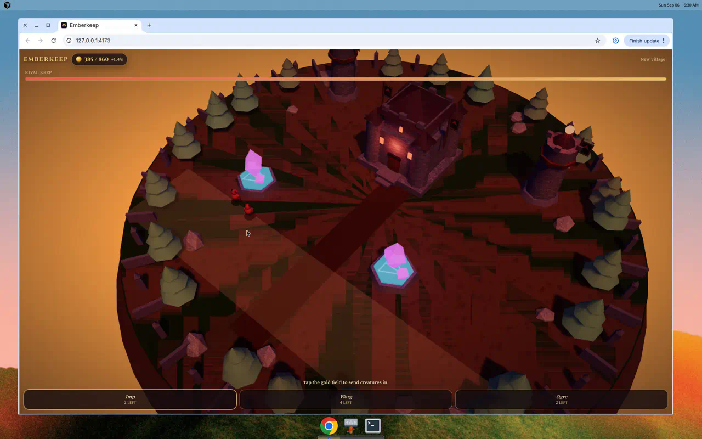

# Emberkeep

A browser-first fantasy village builder — stone keep, mana crystals, a short raid.

Boots straight into the village. No accounts, no servers, no clans. Save lives in `localStorage`.

## Play

On a phone, open the GitHub Pages URL (HTTPS):

**https://blazin-ninja.github.io/grok-bot/**

If that 404s, enable Pages once (this repo starts with Pages off):

1. Repo **Settings → Pages**
2. Source: **Deploy from a branch**
3. Branch: `gh-pages` / `/` (the workflow publishes that branch)
4. Save, then wait a minute

Local play:

```bash
npm install
npm run dev
```

Then open the printed localhost URL. Touch: drag to pan, pinch to zoom. Mouse: drag + wheel.

```bash
npm test        # economy / save / upgrade checks
npm run build   # production bundle in dist/
npm run preview # serve the production build
```

## What you can do

1. Pan and zoom the tilted 3D village.
2. **Build** a mana crystal, dragon vault, and warding tower on the grid (keep is already raised).
3. Gold drips while the tab is open. Closing the tab stores a timestamp; reload applies a simple offline catch-up (capped at 3 hours).
4. Tap the keep (or any building) and **Upgrade** — a short visible timer, then a new level.
5. **Raid**: pick a warband of imps, worgs, and ogres, deploy them on the gold field of a premade rival hold, fight, take loot.
6. Progress writes itself to the browser. **New village** clears it.

## Stack

Vite + TypeScript + Three.js. Buildings and creatures are composed meshes with painted materials (stone, wood grain, roof tiles, banners) under bright midday light — a Clash-like fantasy village, not a CoC IP clone.

Android / native is out of scope. This slice is the web game.

## Screenshots

Village (keep, mana crystal, vault, tower) and a raid on the rival hold:





Phone-width village: [`docs/phone.png`](docs/phone.png). Upgrade sheet: [`docs/upgrade.png`](docs/upgrade.png).

Before → after visual notes: [`docs/COMPARE.md`](docs/COMPARE.md).
